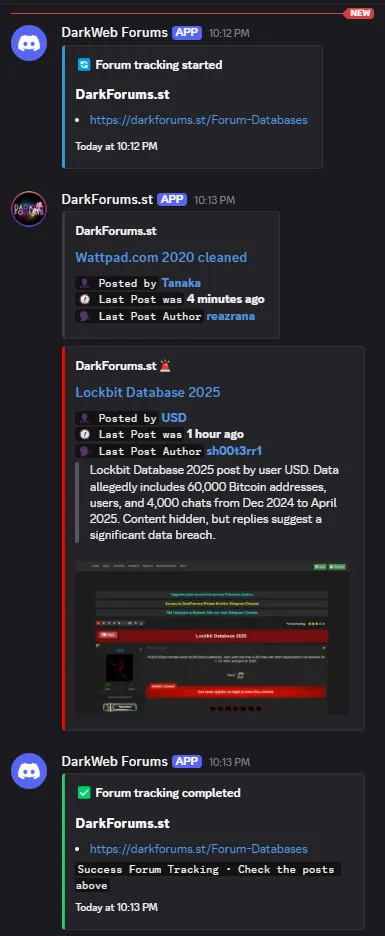

# 🕵️ DarkWeb Forums Tracker

> **A tool I built to automatically monitor darkweb forums and deliver threat intelligence alerts to Discord**

Tired of manually checking darkweb forums for threat intelligence? I created this automation system that uses AI agents to scrape forum posts, detect keyword alerts, and deliver professional threat intel straight to your Discord. It's a personal project for my portfolio, but I hope it helps other cybersecurity folks stay informed about underground activities without the manual work.

<div align="center">

[](https://docker.com) [](https://ai.google.dev) [](https://n8n.io) [](https://github.com/microsoft/playwright-mcp) [](https://supabase.com) [](https://discord.com)



</div>

## 🎯 The Problem I'm Solving

After spending way too much time manually monitoring darkweb forums for threat intelligence, I realized we all face the same frustrations:

- **⏰ Manual monitoring takes forever** - Checking multiple forums every day eats up your time
- **🌙 Easy to miss important stuff** - Critical posts happen while you're sleeping or busy
- **📊 Information overload** - Hundreds of posts with no good way to prioritize what matters
- **🔄 Same routine every day** - Manually checking the same forums over and over
- **📱 Hard to share with the team** - Screenshot and copy-pasting isn't scalable
- **🛡️ Stealth requirements** - Forums detect and block automated scrapers

## 💡 What I Built

So I built this **DarkWeb Forums Tracker** to automate the tedious monitoring routine:

✨ **AI Does the Monitoring** - Google Gemini powered agents scrape forums with human-like behavior  
🤖 **Workflows Handle Everything** - n8n orchestrates the entire forum monitoring pipeline automatically  
📱 **Discord Delivers Alerts** - Real-time notifications with screenshots for keyword matches  
🖥️ **Human-in-the-Loop** - VNC interface allows manual intervention for CAPTCHAs and login challenges  
🐳 **Easy Setup** - Just run `docker compose up -d` and you're monitoring forums  
🕐 **Every 4 Hours** - Set-and-forget automation that runs around the clock  

## 👥 Who Might Find This Useful

If you're dealing with threat intelligence monitoring, this might help:

- **🛡️ SOC Teams** - Early warning system for emerging threats
- **🕵️ Threat Hunters** - Monitor threat actor communications and TTPs
- **📡 Threat Intel Analysts** - Automate darkweb data collection
- **👁️ Security Managers** - Executive summaries of underground activities  
- **🔒 Security Consultants** - Threat intelligence as a service for clients
- **🏢 MSP Teams** - Monitor threats targeting your client industries

## 🚀 Quick Start

**Prerequisites**: Docker, Supabase Cloud account, Discord webhook, Google Gemini API key

```bash
# Clone and setup
git clone https://github.com/brunosergi/darkweb-forums-tracker.git
cd darkweb-forums-tracker
cp .env.example .env

# Configure your .env with Supabase and API credentials
# Launch the platform
docker compose up -d

# Configure N8N credentials at http://localhost:5678
# Activate both workflows and start monitoring!
```

> **📖 Complete Setup Guide**: See [SETUP.md](SETUP.md) for detailed step-by-step configuration

**Services**: N8N (5678) • VNC (6080) • Discord alerts every 4 hours

## 🛠️ What's Under the Hood

### Core Tools
- **[n8n](https://n8n.io)** - Visual workflows that connect everything together
- **[Playwright MCP](https://github.com/microsoft/playwright-mcp)** - AI-powered browser automation with stealth capabilities
- **[Google Gemini](https://ai.google.dev)** - The LLM that reads and analyzes forum content
- **[Supabase](https://supabase.com)** - Cloud PostgreSQL database with file storage
- **[Discord Webhooks](https://discord.com)** - Where your team gets the real-time alerts
- **[Docker](https://docker.com)** - Everything runs in containers

### Forum Sources

## 📋 How It Works

1. **🕵🏿 DarkForums.st** - Track database leaks and breach discussions
2. **🕐 Scheduled Monitoring** - System checks configured forums every 4 hours
3. **🤖 AI Agent Scraping** - Playwright MCP with browser automation extracts forum posts and timestamps
4. **🔍 Smart Deduplication** - Only processes new posts (no duplicates from database)
5. **🎯 Entity Detection** - Advanced keyword matching with canonical names, variations, and text normalization
6. **🔄 Retry Logic** - 2-attempt retry system with intelligent backoff for failed operations
7. **📸 Screenshot & Analysis** - For alerts: captures screenshots and generates AI summaries
8. **📱 Discord Delivery** - Comprehensive logging with color-coded alerts and detailed status updates
9. **💾 Database Storage** - Enhanced schema with timestampz format and entity tracking

## 🖥️ Human-in-the-Loop VNC Interface

### **Common Scenarios**
- **CAPTCHA Solving**: AI gets stuck on DDoS-Guard or forum CAPTCHAs
- **Manual Login**: First-time authentication for login-protected forums
- **Bot Detection**: Bypass anti-bot measures that require human interaction
- **Session Recovery**: Re-authenticate when login sessions expire

### **How It Works**
1. **AI Agent Running**: Playwright MCP browser automation in progress
2. **Challenge Detected**: Agent encounters CAPTCHA or login requirement
3. **Manual Intervention**: Connect to VNC and solve the challenge
4. **AI Continues**: Agent resumes automated scraping after manual help

The VNC interface runs a full Chrome browser where you can see exactly what the AI agent sees and interact with any elements that require human input.

<div align="center">


</div>

<div align="center">


</div>

### **Quick Manual Access**

When you need to manually control the browser for troubleshooting, authentication, or CAPTCHA solving:

**VNC Web Interface:** Access http://localhost:6080
- Press **Alt+F2** and enter: `chromium`
- Or right-click desktop → Applications → run terminal and type: `chromium &`

**Container Terminal:**
```bash
docker exec -it darkweb-forums-tracker-playwright bash
chromium &
```

Perfect for solving CAPTCHAs, setting up authentication cookies, debugging failed scrapes, or manually navigating complex login flows that the AI agent couldn't handle automatically.

## 💡 V1 MVP Features

✅ **Schedule trigger** - Starts each 4 hours  
✅ **Discord notifications** - Send scan started info (helps human attention if something goes wrong)  
✅ **Forum URL loop** - Given URLs for forums to iterate through  
✅ **AI Agent scanning** - Scan current URL target in loop  
✅ **Error handling** - IF loop success → continue workflow, IF loop fail → failure branch (bot_captcha, login_needed, etc)  
✅ **Deduplication** - Remove duplicate posts  
✅ **Keyword branch separation** - Add keywords to "Keywords" node in array format (user customizable)  
✅ **Alert workflows** - IF has any keyword → alert branch (screenshot + AI summary), IF no keywords → normal branch  
✅ **Human-in-the-Loop VNC** - Web-based browser GUI for manual CAPTCHA solving and login assistance  
✅ **Shared browser sessions** - VNC and Playwright MCP use same Chromium executable with shared user data directory for persistent login sessions  
✅ **AI Agent retry logic** - 2-attempt retry system with intelligent backoff and Discord notifications  
✅ **Enhanced entity detection** - Smart keyword matching with canonical names, variations, and text normalization  
✅ **Timestamp format standardization** - All dates stored in timestampz format for proper temporal analysis  
✅ **Advanced Discord logging** - Comprehensive status tracking with color-coded alerts and detailed error reporting  
✅ **Database storage** - Saves everything for historical analysis and tracking
✅ **Discord results** - Send to Discord with distinction between normal/alert posts using entity-based detection  

## 🗺️ What I'm Planning Next

### 🏢 **Forum & Data Improvements**
- **Multiple forums support** - Track breach forums, lockbit, xss.is, etc.
- **Scroll down** a little bit before taking screenshot for better view
- **Modularize workflows** into multiple workflows to separate concerns

### 🤖 **Authentication & Anti-Bot**
- **Solve captcha and login sub-workflow tools** - Call AI Agents to handle automatically
- **Discord notifications** asking for human presence when captcha/forum blocks occur
- **Commercial/residential proxies** support for anti-bot problems (IP rotation, captcha solver)
- **AI Agent auto-login** - Provide forum credentials in .env for AI Agent usage


### ⚡ **Technical Enhancements**
- **AI agent N8N model selector** - Define which LLM to use and AI Agent fallback
- **2nd AI Agent retry logic** - Apply same 2-attempt retry system to alert post analysis workflow
- **pg_vector** - Vectorize Supabase data and turn forum posts into RAG for AI chat
- **Better schedule trigger** - Configure minutes/hours for each forum URL path
- **Tor proxy** to reach .onion forums
- **More notification apps** - Slack, Telegram, etc.

These features will transform it from a simple forum monitor into a comprehensive darkweb threat intelligence platform. The goal is to make it reliable enough that security teams actually depend on it for underground threat detection.

---

<div align="center">

**⭐ Star this repo if you find it useful!**

[📖 Setup Guide](SETUP.md) • [⚙️ Workflows](n8n/workflows)

Just a guy building tools for the cybersecurity community 🛡️

</div>