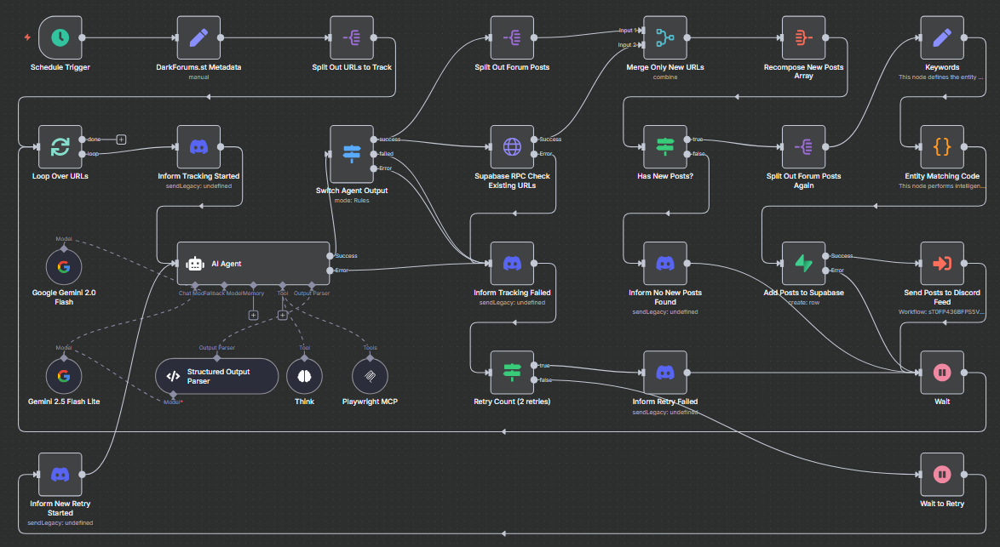
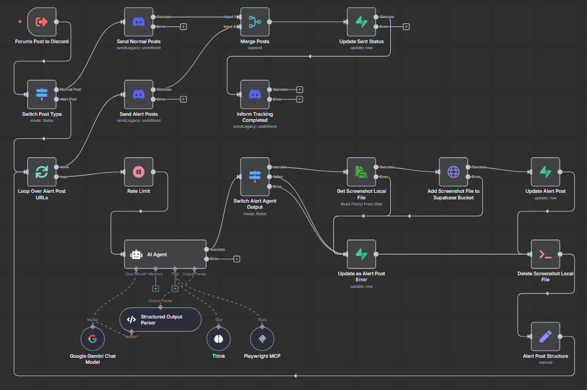
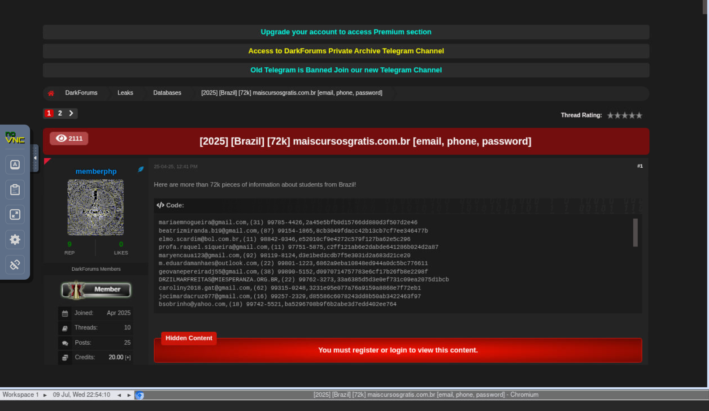
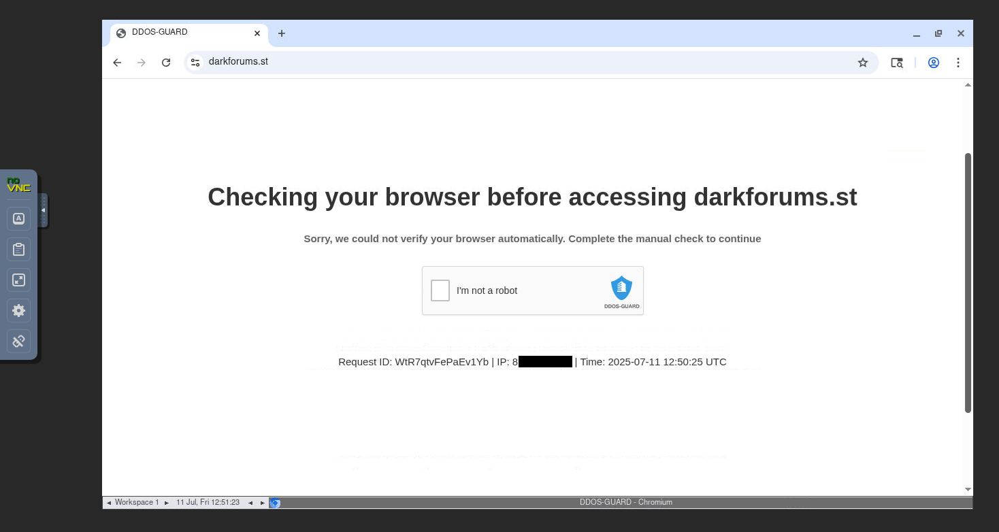
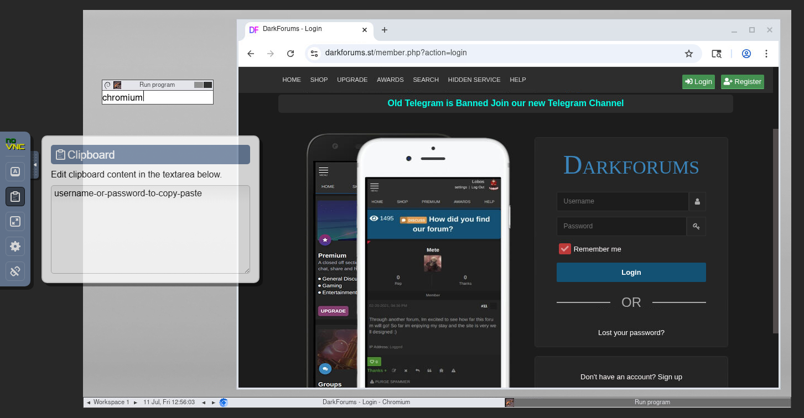

# 🕵️ DarkWeb Forums Tracker - Complete Setup Guide

Complete deployment guide from git clone to monitoring darkweb forums with Discord alerts.

## Prerequisites

- **Docker** (v20.10+) and **Docker Compose** (v2.0+)
- **Git** for cloning the repository
- **Supabase Cloud account** (free tier works)
- **Google Gemini API Key** (free from [Google AI Studio](https://aistudio.google.com/))
- **Discord webhook URL** for notifications

---

## 🎯 Quick Deployment

### 1. Clone & Configure

```bash
git clone https://github.com/brunosergi/darkweb-forums-tracker.git
cd darkweb-forums-tracker
cp .env.example .env
```

### 2. Supabase Cloud Setup

1. **Create Project**: Go to [supabase.com](https://supabase.com) and create a new project
2. **Get Project URL**: Copy your project URL from Settings → API  
3. **Get Service Role Key**: Copy your service role key from Settings → API
4. **Run Database Script**: 
   - Go to SQL Editor in Supabase dashboard
   - Copy and run the complete script from `supabase/supabase.sql`
5. **Create Screenshot Bucket**:
   - Go to Storage in Supabase dashboard
   - Create a new bucket named `screenshots`
   - Make it **Public** (required for Discord embeds)
   - Optional: Set 500KB upload limit and restrict to `image/jpeg`

### 3. Edit Environment Variables

Open `.env` and configure these essential variables:

```bash
# Supabase Cloud Configuration
SUPABASE_URL=https://your-project.supabase.co

# N8N Configuration (generate strong random strings)
N8N_ENCRYPTION_KEY=your-super-secret-key-here-32-chars-min

# Database Configuration
POSTGRES_PASSWORD=your-super-secret-and-long-postgres-password
POSTGRES_DB=postgres
```

### 4. Launch Platform

```bash
docker compose up -d
```

This automatically:
- Sets up PostgreSQL database for N8N
- Configures Redis for N8N queue management
- Launches Playwright MCP with VNC support and shared browser sessions
- Imports N8N workflows with enhanced AI agent and retry logic
- Starts all services with health checks

### 5. Verify Services Running

```bash
docker compose ps
```

All services should show "healthy" status.

---

## 🔧 N8N Configuration

### Access N8N Editor

1. Open **http://localhost:5678**
2. Create your admin account (first-time setup)
3. Configure credentials (this is the only manual step required)

### Add Supabase Credentials

**Settings** → **Credentials** → **Add New**

**Supabase API Credential:**
- **Name**: `Supabase Cloud`
- **URL**: Your Supabase project URL (e.g., `https://your-project.supabase.co`)
- **Service Role Key**: Use `SUPABASE_SERVICE_ROLE_KEY` from your Supabase project settings

### Add Google Gemini Credentials

**Add Google Gemini API Credential:**
- **Name**: `Gemini API`
- **API Key**: Your Google Gemini API key from [Google AI Studio](https://aistudio.google.com/)

### Add Discord Webhook Credentials

**Create Discord Webhook:**
1. **Choose Discord Channel**: Go to the Discord channel where you want to receive forum notifications
2. **Edit Channel Settings**: Right-click the channel → **Edit Channel**
3. **Access Integrations**: Go to **Integrations** tab
4. **Create New Webhook**: Click **Create Webhook** (or **View Webhooks** → **New Webhook**)
5. **Configure Bot**:
   - **Name**: `DarkWeb Forums Tracker` (or your preferred name)
   - **Channel**: Select the target channel for notifications
   - **Avatar**: Optional - upload a custom bot logo
6. **Copy Webhook URL**: Click **Copy Webhook URL**

**Add Discord Webhook Credential in N8N:**
- **Name**: `Discord Webhook`
- **Webhook URL**: Paste the Discord webhook URL you copied
- **Test**: Send a test message to verify the webhook works

### Update Workflow Credentials

**Important**: Even if nodes don't show errors, manually verify credentials in these workflows:

**darkweb-get-forum-posts:**
- "AI Agent" → "Google Gemini Chat Model" node
- "Supabase RPC Check Existing URLs" → "Supabase RPC" HTTP Request node
- "Add Posts to Supabase" → Supabase node
- All Discord nodes
- "Keywords" → Configure entity dictionary with canonical names and variations

<div>



</div>

**darkweb-send-forum-posts-to-discord:**
- "AI Agent" → "Google Gemini Chat Model" node
- "Add Screenshot File to Supabase Bucket" → "Supabase RPC" HTTP Request node
- "Update Alert Post" → Supabase update node
- "Update as Alert Post Error" → Supabase update node
- "Update Sent Status" → Supabase update node
- All Discord nodes

<div>



</div>

### Activate Workflows

1. Go to **Workflows** in N8N
2. Click **Activate** toggle for both workflows:
   - `darkweb-get-forum-posts` (main monitoring workflow with retry logic and entity detection)
   - `darkweb-send-forum-posts-to-discord` (Discord notification + Alert Posts AI Agent workflow with enhanced logging)

---

## 🖥️ VNC Configuration (Human-in-the-Loop)

### Access VNC Interface

**Web Browser (Recommended)**: http://localhost:6080
- No software installation required
- Works in any modern browser
- Click "Connect" to access the desktop

**VNC Client**: `localhost:5900`
- Use TightVNC, RealVNC, or any VNC viewer
- No password required (development mode)

### When to Use VNC

- **CAPTCHA Solving**: When AI agents get stuck on DDoS-Guard or forum CAPTCHAs
- **Manual Login**: First-time authentication for login-protected forums
- **Session Recovery**: Re-authenticate when login sessions expire
- **Bot Detection**: Bypass anti-bot measures requiring human interaction

The VNC interface runs a full Chrome browser where you can see exactly what the AI agent sees and interact with any elements that require human input.

### Manual Browser Control

When you need to manually launch Chromium for troubleshooting, authentication, or CAPTCHA solving:

**VNC Web Interface:** Access http://localhost:6080
- Press **Alt+F2** and enter: `chromium`
- Or right-click desktop → Applications → run terminal and type: `chromium &`

**Container Terminal:**
```bash
docker exec -it darkweb-forums-tracker-playwright bash
chromium &
```

Perfect for solving CAPTCHAs, setting up authentication cookies, debugging failed scrapes, or manually navigating complex login flows that the AI agent couldn't handle automatically.

<div align="center">



</div>

<div align="center">




</div>

---

## 🎉 Start Monitoring Forums

### Verify Everything Works

1. **Check N8N**: http://localhost:5678 - Both workflows should be active
2. **Test VNC**: http://localhost:6080 - Should show desktop with browser
3. **Check Discord**: Verify webhook URLs work
4. **Database**: Confirm `darkweb_forums` table exists in Supabase

### Monitor Execution

**The system runs automatically every 4 hours, but you can:**
- **Manual Trigger**: Execute workflows manually in N8N for testing
- **Check Logs**: View execution logs in N8N for debugging
- **VNC Monitoring**: Watch browser automation in real-time via VNC
- **Discord Updates**: Get notified of scan start/completion/failures

### Expected Discord Flow

1. **"Forum tracking started"** - Scan begins with tracking notification
2. **Forum posts** - Normal posts (blue) and entity alerts (red with screenshots and AI summaries)
3. **Retry notifications** - Yellow alerts if initial attempts fail
4. **"Forum tracking completed"** - Scan finished with timestamp and processing statistics

---

## 🔄 Customization

### Add More Forums

**In `darkweb-get-forum-posts` workflow:**
1. Update "DarkForums.st Metadata" node
2. Add new forum URLs to the forum list
3. Modify AI agent prompts for forum-specific parsing

### Configure Entity Detection Keywords

**In `darkweb-get-forum-posts` workflow:**
1. Find the "Keywords" node
2. Update the entity dictionary with canonical names and variations:
```javascript
[
  ["lockbit"],
  ["facebook", "meta"],
  ["bank of america", "bak"],
  ["united states", "united states of america", " usa ", "american"],
  ["brasil", "brazil", ".br", ".com.br", "brazilian"],
  ["twitter", "x.com", "tweet"]
]
```
**Note**: Each array represents one entity - first element is the canonical name, others are variations/aliases.

### Change AI Models

**Switch from Gemini to other models:**
1. Add new AI provider credential in N8N
2. Replace "Google Gemini Chat Model" nodes
3. Update prompts for different model capabilities

---

## 🛠️ Service URLs

| Service | URL | Purpose |
|---------|-----|---------|
| **N8N Workflows** | http://localhost:5678 | Automation management |
| **VNC Browser** | http://localhost:6080 | Human-in-the-loop interface |
| **Supabase Dashboard** | Your cloud project URL | Database management |
| **Playwright MCP** | http://localhost:8831 | Browser automation service |

---

## 🔧 Troubleshooting

### Common Issues

**N8N credential errors:**
- Verify all credentials are saved in N8N UI
- Check Supabase URL and service role key
- Test credentials in N8N credential settings

**Workflow execution failures:**
- Check Google Gemini API quota/rate limits (retry logic will attempt 2 times)
- Verify Playwright MCP is accessible at port 8831
- Ensure Discord webhook URLs are valid
- Monitor retry attempts in N8N execution logs

**VNC connection issues:**
- Confirm port 6080 is accessible
- Check Docker container logs: `docker logs darkweb-forums-tracker-playwright`
- Restart Playwright container if needed

**Screenshot upload failures:**
- Ensure Supabase `screenshots` bucket exists and is public
- Verify service role key has storage permissions
- Check bucket size limits and file type restrictions

**Forum access blocked:**
- Use VNC to manually solve CAPTCHAs
- Consider adding proxy support for IP rotation
- Check if forum requires login/registration

### Database Issues

**Missing table errors:**
```bash
# Verify table exists with new schema in Supabase SQL Editor
SELECT id, post_title, post_date, last_post_date, post_alert, entity_name 
FROM public.darkweb_forums LIMIT 1;

# If missing or schema outdated, re-run the supabase/supabase.sql script
```

**RLS (Row Level Security) warnings:**
- The updated `supabase/supabase.sql` script includes proper RLS policies
- Re-run the script if you see RLS warnings

### Reset Everything

```bash
# Reset local containers (keeps Supabase cloud data)
docker compose down -v --remove-orphans
docker compose up -d

# Reimport workflows in N8N if needed
# Reconfigure credentials in N8N UI
```

---

## 📊 Monitoring & Maintenance

### Performance Monitoring

- **N8N Executions**: Monitor workflow success/failure rates
- **Supabase Usage**: Track database storage and API calls
- **Discord Rate Limits**: Ensure webhook calls stay within limits
- **VNC Usage**: Monitor browser resource consumption

### Regular Maintenance

- **Keyword Updates**: Review and update alert keywords monthly
- **Forum List**: Add new forums as they become relevant
- **Credential Rotation**: Update API keys and passwords regularly
- **Log Cleanup**: Archive old execution logs in N8N

---

🎉 **You're Ready!** Your darkweb forums tracker is now monitoring forums and sending Discord alerts automatically. Use VNC at **http://localhost:6080** for any manual intervention needed.